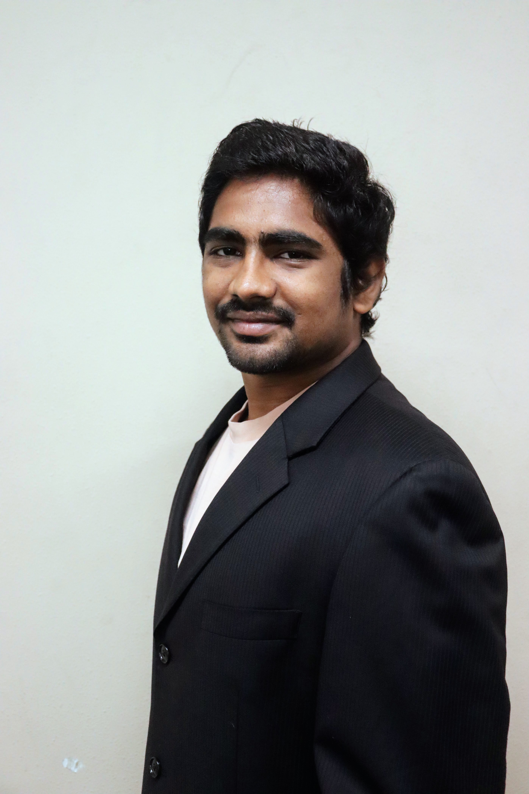

# Introduction

  

    
  

  

    <h2 style="font-family: 'Times New Roman', Times, serif;">My BIO</h2>
    

      Hi, I'm Mohan, currently attending USF in Tampa. I have experience in consulting, management, data visualization, and web application development, focusing on handling academic and Institutions data. I recently completed an internship at BST Global, contributing to resource utilization analytics using Power BI, SQL, Excel and Python. I’m continuously learning to enhance my skills in project management and product development.
    

  

